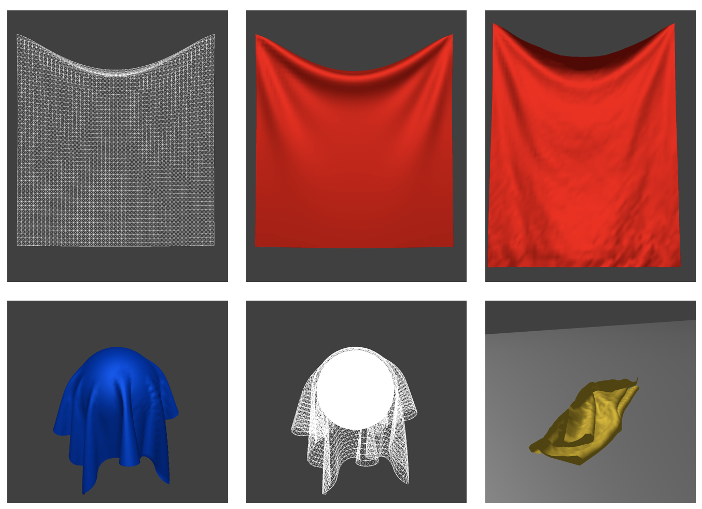

# Cloth-Simulator
A real-time cloth simulation engine

## Write-Up
You can read my detailed [writeup](https://michael-tu.github.io/Cloth-Simulator/) to understand what features I have implemented, how I developed them, see many of the cool results, and view side-by-side comparisons of the performance by different techniques.

## Glimpse of Results




## Build System

If you don't have [CMake](https://cmake.org) (version >= 2.8) on your personal computer, you can install it using `apt-get` on Linux or `Macports/Homebrew` on OS X. Alternatively, you can download it directly from the CMake website.

To build the code, start in the folder that GitHub made or that was created when you unzipped the download. 

Run
```
mkdir build; cd build
```

to create a build directory and enter it, then

```
cmake ..
```

to have CMake generate the appropriate Makefiles for your system, then

```
make 
```

to make the executable, which will be deposited in the build directory.
